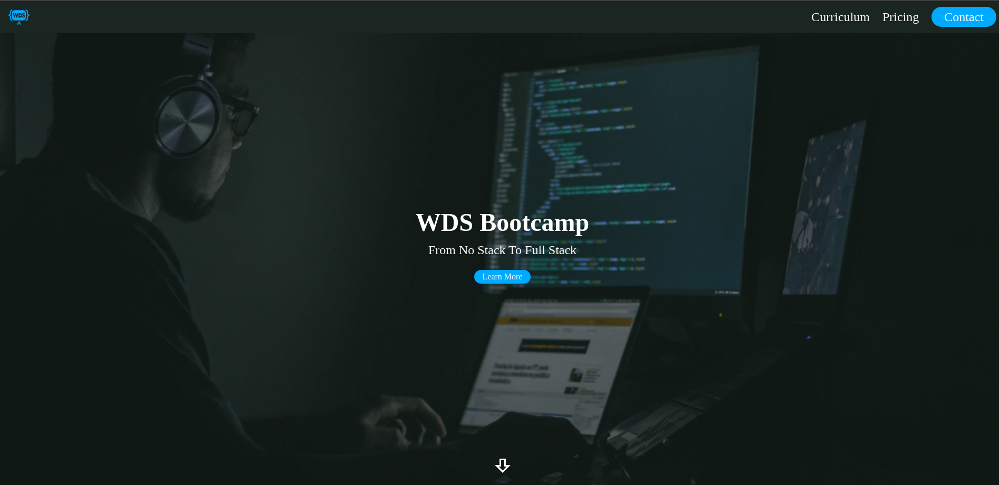
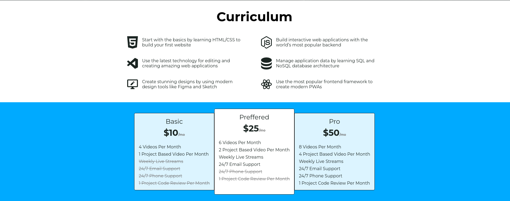
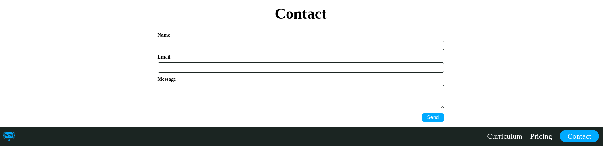

# A Website For The Best Courses

> From No Stack To Full Stack

 
 

+ Start with the basics by learning HTML/CSS to build your first website
+ Build interactive web applications with the world’s most popular backend
+ Use the latest technology for editing and creating amazing web applications
+ Manage application data by learning SQL and NoSQL database architecture
+ Create stunning designs by using modern design tools like Figma and Sketch
+ Use the most popular frontend framework to create modern PWAs

## Desktop

### **_Header_**

### **_Curriculum_**

### **_Footer_**

