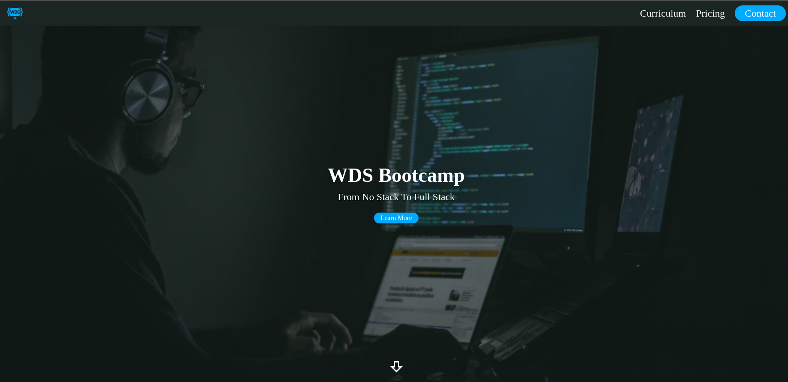
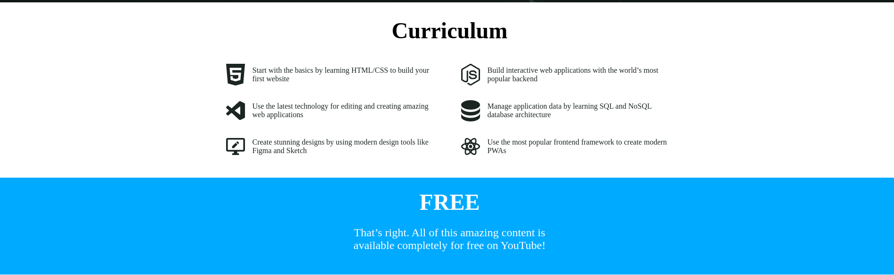
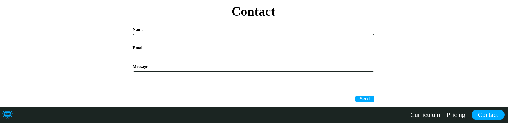

# A Website For A Best Coures

> From No Stack To Full Stack

+ Start with the basics by learning HTML/CSS to build your first website
+ Build interactive web applications with the world’s most popular backend
+ Use the latest technology for editing and creating amazing web applications

